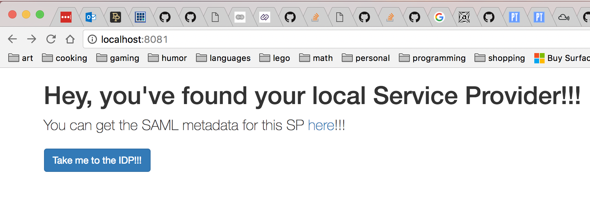
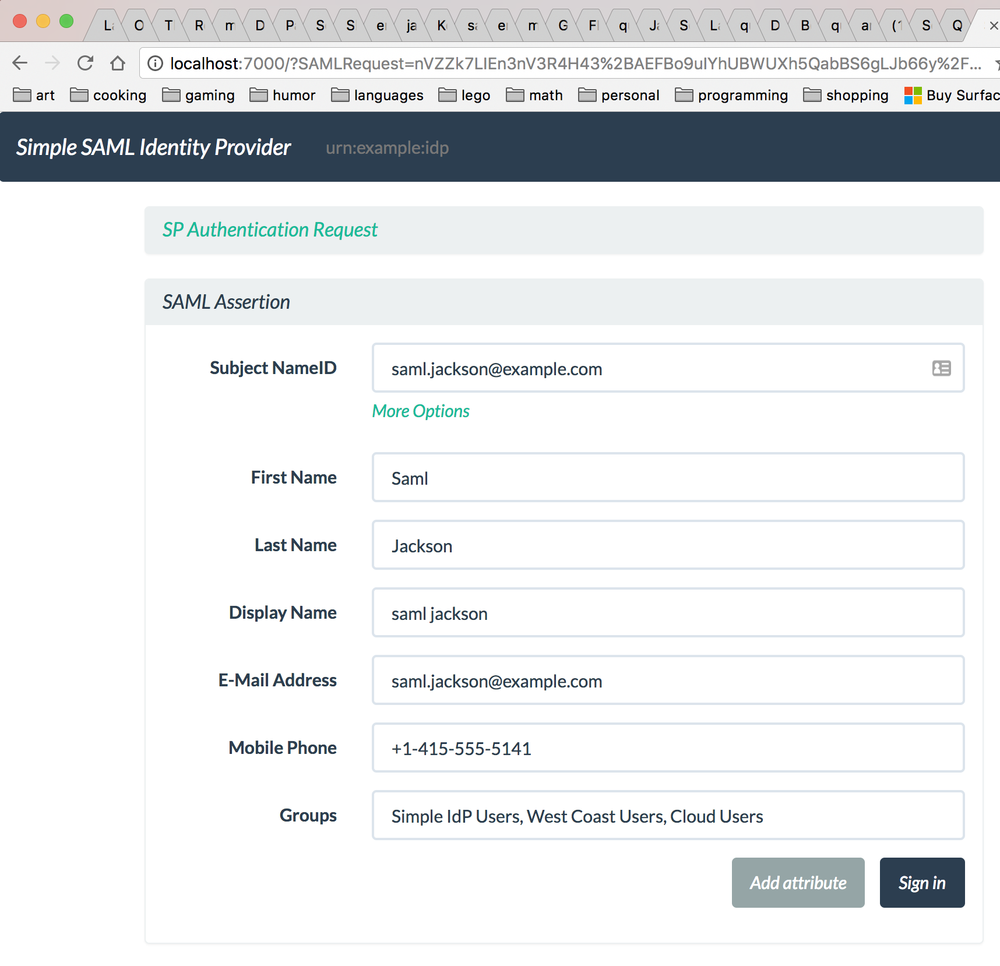

# saml-test

## Why did I do this?

At $DAYJOB, I was charged with investigating how to integrate Single Sign-On (SSO) into a potential new Clojure-based application.
And so, I needed to find a library, preferably one in Clojure not Java since I have found Clojure libraries to be far simpler and easier to work with.
I also hoped to have a test Identity Provider (IDP) server at my disposal but our company had none already, and we weren't yet ready to partner with a third-party provider.
I searched for a free online service, but could not find one that either worked or for which I could successfully set up an account.
And I _really_ didn't want to have to install and configure something as complex as Shibboleth just for a proof-of-concept.

## Goals

Ideally, I wanted a completely self-contained project which fulfilled the following:

* Exposes a minimally functional Service Provider (SP) endpoint
* Uses a Clojure library that "speaks" SAML
* Does not require any external installation and configuration of an IDP
* Demonstrates a round trip conversation from SP to IDP and back to SP
* Implements a minimal authorization scheme

## Discussion

After a decent amount of googling, I found what seemed to be the best Clojure library for handling SSO and SAML, `saml20-clj`.
It has a complete implementation for doing this, has a fairly easy-to-use API, and it comes with a demo SP implementation, although not fully flushed out.

Below is a diagram illustrating the conversation between all three parties that I wanted to have take place in this demo project.

```
                                                    +-------+
             --------------------4------------------|  IDP  |
            |  ------------------3----------------->+-------+
            | |
            | |
            | |
            | |
            v |
         +-------+
        -|  User |
       | +-------+
       |    ^ |
       |    | |
       |    | |
       |    | |
       |    | |
       |    | -------------------1----------------->+-------+
       |     --------------------2------------------|  SP   |
       |                                            +-------+
        ----------------------5-------------------------^

```

The five parts of this conversation are the following:

1. The user sends the first request to the SP endpoint.  
1. The SP responds by sending a HTTP 302 status code back with the IDP URL to the user.  
1. The user's browser then makes its first request to the IDP with the return URL for the SP.  
1. Upon successful authentication into the IDP, it sends another 302 to the user.  
1. Finally, the user returns to the SP with a SAML payload from the IDP.  

As I said above, `saml20-clj` does have a little demo SP but weirdly the Compojure routes are partially defined in the library itself.
(That was actually the first thing that motivated me to create my own project.)
Likewise, I implemented the routes using Compojure, not using any of the ones in the library.

The next thing I needed to do was search for an IDP that I could somehow spin up from within this project.
I was inspired by the `lein-postgres` plugin which allows a full-fledged Postgres instance to be available without any separate installation process.
I tried a couple of Java-based ones, including [Mujina](https://github.com/OpenConext/Mujina), hoping to exploit Maven to similarly start and stop the server,
but I could not figure out how to get it configured to work with my local SP.
(Specifically, I could not figure out how to get it to allow a `GET` from the user to authenticate into it,
as well as not being able to successfully `PUT` the SP's metadata into it.)
I had even lesser success with another Java implementation, [MockIDP](https://github.com/rasmusson/MockIDP). 
I also tried a couple of free online IDP's but I just had no luck with them, 
among them [https://openidp.feide.no/](https://openidp.feide.no/) and [https://zxidp.org/index-idp.html](https://zxidp.org/index-idp.html), likewise not being able to upload SP metadata.

I finally capitulated and searched for a minimal mock IDP which I could install locally.
I came across `saml-idp`, a node.js implementation, and found it trivial to get configured and working.
But then I wondered if someone had ever made a Leiningen plugin to invoke `npm`;
I had completely forgotten that of course one exists for ClojureScript!
And there's also a plugin for `bower`. 
So I decided to use them not for building a ClojureScript application but just for downloading and installing dependencies.
It's a bit perverse... but it works!

#### TODO: Say something about normally needing to upload SP metadata to IDP

## Getting things running

#### Clone this repo

Download this project to a local directory:

    git clone https://github.com/quephird/saml-test

#### Download and build IDP

`cd` into the `saml-test` directory.
Then download and build the IDP project; this can all be done through Leiningen:

    lein npm install  
    lein bower install

#### Generate keystore

Create a new keystore, and generate a new certificate for the SP in it:

    keytool -keystore keystore.jks -genkey -alias mylocalsp

Create a new certificate for the IDP:

    openssl req -x509 -new -newkey rsa:2048 -nodes \
        -subj '/C=US/ST=Some state/L=Some city/O=Some org/CN=Local IDP' \
        -keyout ./node_modules/saml-idp/idp-private-key.pem \
        -out ./node_modules/saml-idp/idp-public-cert.pem \
        -days 7300

Import the IDP certificate into the new keystore:

    keytool -import -keystore keystore.jks \
        -file ./node_modules/saml-idp/idp-public-cert.pem \
        -alias mylocalidp

Check to see that both certificates are in fact in the keystore:

    keytool -list -keystore keystore.jks

You should see something like this:

    Keystore type: JKS
    Keystore provider: SUN
    
    Your keystore contains 2 entries
    
    mylocalsp, Mar 10, 2017, PrivateKeyEntry,
    Certificate fingerprint (SHA1): 01:EE:4C:D0:46:F2:1D:31:08:EF:ED:1C:E2:CF:E7:AD:73:4F:6E:EB
    mylocalidp, Mar 14, 2017, trustedCertEntry,
    Certificate fingerprint (SHA1): AE:F1:34:11:2E:C3:6A:FE:B9:52:35:66:68:2F:F8:72:2F:0A:7E:28

#### Start servers

In one session, start the IDP:

    cd ./node_modules/saml-idp/
    node app.js \
        --acs http://localhost:8081/saml \
        --aud http://localhost:8081/saml

In another session, start the SP:

    lein run

#### Test SSO

Now in your browser go to [http://localhost:8081](http://localhost:8081); you should see something like this:



Click the button and you should be taken to the IDP with a screen resembling this:



There is no authentication mechanism implemented in `saml-idp` but that's ok; 
all we really want to demonstrate is that we can have the IDP send a valid SAML response back to the SP.

#### TODO: Finish discussion and add screen caps

#### TODO: Talk about future goals

## Important links

Wikipedia article on SAML  
[https://en.wikipedia.org/wiki/Security_Assertion_Markup_Language](https://en.wikipedia.org/wiki/Security_Assertion_Markup_Language)

`saml20-clj`  
[https://github.com/vlacs/saml20-clj](https://github.com/vlacs/saml20-clj)

`lein-npm`  
[https://github.com/RyanMcG/lein-npm](https://github.com/RyanMcG/lein-npm)


`lein-bower`  
[https://github.com/chlorinejs/lein-bower](https://github.com/chlorinejs/lein-bower)


`saml-idp`  
[https://github.com/mcguinness/saml-idp](https://github.com/mcguinness/saml-idp)
  
## License

Copyright (C) 2017, ⅅ₳ℕⅈⅇℒℒⅇ Ҝⅇℱℱoℜⅆ.

Distributed under the Eclipse Public License either version 1.0 or (at your option) any later version.
